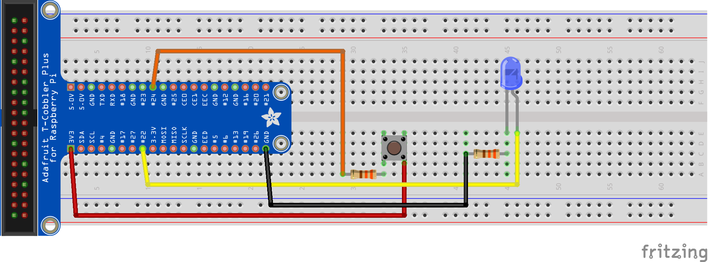

# Pi4J V2 :: Java I/O Library for Raspberry Pi :: Minimal "FAT JAR" application
===============================================================================

GitHub Actions: 


This project contains a minimal example application which uses the Pi4J (V2) library and uses a digital output (LED) 
and digital input (push button). Full description is available on [the Pi4J website](https://v2.pi4j.com/getting-started/minimal-example-application)

## PROJECT OVERVIEW

The goal of the example project is to show how to set up a Pi4J Maven / Gradle project for the Raspberry Pi.

## MAVEN SHADE PLUGIN

Because of the use of the ServiceLoader to dynamically load the plugins which are part of the project, the FAT JAR created
by this code, all the files in `META-INF/services` need to be merged into one. This is not possible with the `Maven Assembly
Plugin` that could be used with Pi4J V1.

A solution was found based on

* Replies to [this tweet](https://twitter.com/khmarbaise/status/1479368488787578880) by [Robert Scholte](https://twitter.com/rfscholte)
and [Karl Heinz Marbaise](Karl Heinz Marbaise)
* Replies to [this GitHub discussion](https://github.com/Pi4J/pi4j-v2/discussions/178) by [Michael Paus ](https://github.com/mipastgt)

To create a correct FAT JAR the `Maven Shade Plugin` needs to be used, with the additional 
[ServicesResourceTransformer](https://maven.apache.org/plugins/maven-shade-plugin/examples/resource-transformers.html#ServicesResourceTransformer). 
As described on the Apache documentation page: *JAR files providing implementations of some interfaces often ship with 
a META-INF/services/ directory that maps interfaces to their implementation classes for lookup by the service locator. 
To relocate the class names of these implementation classes, and to merge multiple implementations of the same interface 
into one service entry, the ServicesResourceTransformer can be used.*

## WIRING

The application needs a LED connected on BCM 22 and button on BCM 24. 



## RUNTIME DEPENDENCIES

This project uses Pi4J V.2 which has the following runtime dependency requirements:
- [**SLF4J (API)**](https://www.slf4j.org/)
- [**SLF4J-SIMPLE**](https://www.slf4j.org/)
- [**PIGPIO Library**](http://abyz.me.uk/rpi/pigpio) (for the Raspberry Pi) - This 
dependency comes pre-installed on recent Raspbian images.  However, you can also 
download and install it yourself using the instructions found 
[here](http://abyz.me.uk/rpi/pigpio/download.html).

## MAVEN BUILD DEPENDENCIES & INSTRUCTIONS

This project can be built with [Apache Maven](https://maven.apache.org/) 3.6 
(or later) and Java 11 OpenJDK (or later). These prerequisites must be installed 
prior to building this project.  The following command can be used to download 
all project dependencies and compile the Java module.  You can build this 
project directly on a Raspberry Pi with Java 11+.  

```
mvn clean package
```

### Compiled application to run on the Raspberry Pi

Once the build is complete and was successful, you can find the compiled FAT JAR `pi4j-example-fatjar.jar` in the 
`target` directory. Copy this file to your Raspberry Pi of you are developing on a different computer, and run the 
application with 

```
sudo java -jar pi4j-example-fatjar.jar
```

## LICENSE

 Pi4J Version 2.0 and later is licensed under the Apache License,
 Version 2.0 (the "License"); you may not use this file except in
 compliance with the License.  You may obtain a copy of the License at:
      http://www.apache.org/licenses/LICENSE-2.0

 Unless required by applicable law or agreed to in writing, software
 distributed under the License is distributed on an "AS IS" BASIS,
 WITHOUT WARRANTIES OR CONDITIONS OF ANY KIND, either express or implied.
 See the License for the specific language governing permissions and
 limitations under the License.

